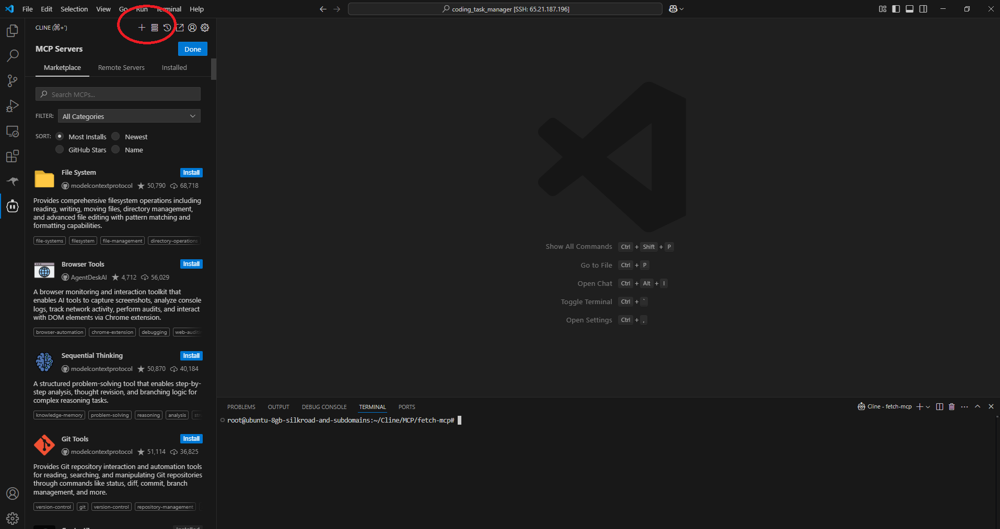

## MCP Setup and Test Instructions (for Cline)

This document provides instructions for creating and using MCP servers with Cline.

### 1. Creating an MCP Server

To create a new MCP server, click MCP Servers icon as shown in image


Once you have created and started your MCP server, Cline can connect to it and use the tools and resources it provides.

### 2. Using MCP Servers with Cline

After connecting an MCP server, you can use its tools via chat interface as it will automatricall be asble use the tool

---

## MCP Setup and Test Instructions (for GitHub Copilot in VS Code)

This document provides step-by-step instructions for configuring and successfully testing Hugging Face MCP integration in VS Code, specifically for use with GitHub Copilot (Agent mode).

### 1. Prerequisites

*   VS Code (latest version recommended)
*   GitHub Copilot extension installed and logged in
*   Hugging Face account (to generate an API token)

### 2. Create the MCP Configuration File

1.  In your project/workspace, create a folder named `.vscode` if it doesn't exist.
2.  Inside `.vscode`, create a file named `mcp.json`.
3.  Add the following content (replace `YOUR_HF_TOKEN` with your Hugging Face token):

    ```json
    {
      "servers": {
        "hf-mcp-server": {
          "type": "sse",
          "url": "https://huggingface.co/mcp",
          "headers": {
            "Authorization": "Bearer YOUR_HF_TOKEN"
          }
        }
      }
    }
    ```

### 3. How to Use MCP with GitHub Copilot

1.  Open your project in VS Code.
2.  Open the Copilot sidebar (click the Copilot icon or use `Ctrl+Alt+I`).
3.  Switch to Agent mode (bottom right of the sidebar, select "Agent").
4.  Test with these successful commands:
    *   `Summarize this code file.`
    *   `Find all TODO comments in this project.`
    *   `Refactor this function for readability.`
    *   `Explain what this code does.`
    *   `Generate Python code for a REST API endpoint.`
5.  Observe the response:
    *   If you get a relevant answer, your MCP setup is working with Copilot.
    *   For internet-dependent queries (like trending models on Hugging Face), you may get a fallback message, which is expected.

### 4. Troubleshooting

*   If you get errors, double-check your token and the JSON structure.
*   Only local/code analysis tasks are supported by default. For more tools, check Copilot or MCP server documentation.

**Note**: This setup is tested and works with GitHub Copilot Agent mode. For other extensions, configuration or tool support may differ.


